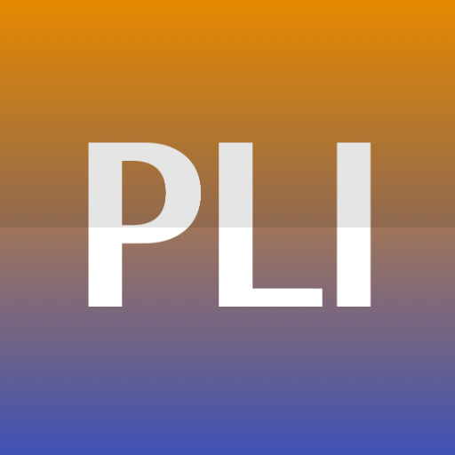

  

# Programming Langage Innovation Lab (PLILab) @ NUS — Towards Next-Generation Programming Languages

Welcome to PLI Lab, an affilation to [NUS PLSE group](https://nus-plse.github.io). We’re reimagining how humans communicate intent to machines.

## Our Vision

In the ideal future we envision, programming will be as natural and expressive as communicating with another human. Programmers will be able to articulate their intent to computers at the same high level and speed they communicate with each other. Software will become **clear and concise**, with code that *obviously has no bugs*—rather than code that *has no obvious bugs*.

## What Drives Our Research

Our work centers on **next-generation languages** and **tools** that:

- Empower developers to write **elegant**, **concise**, and **clear** code.
- Preserve **performance** while enhancing **expressiveness**.
- Improve **code comprehension**, **developer productivity**, and **program design**.
- Enhance **security**, **education**, and **accessibility** through better abstractions.

We believe that better programming languages and tooling are the keystone to:
- Detecting and preventing vulnerabilities
- Lowering the barrier to entry in programming
- Advancing the state of software engineering

## What We're Working Toward

The future we’re working toward may be distant. We might not see it fully realized in our lifetimes—but it’s a future we are deeply passionate about shaping.

Join us as we build the foundation for the next era of software development.

## Onboarding

If you are joining our lab, then send Prof. Adams your GitHub username, and he will add you to our lab's GitHub organization so you can access our lab's private repositories.  Once he adds you, started on your onboarding by following the instructions at <https://github.com/plilab/plilab/blob/master/onboarding.md> (in one of the private repositories).

## Members

| 
| ----
| Michael D. Adams (Assistant Professor and Head of Lab)
| Webpage: https://michaeldadams.org
| Office: COM3‐02‐47
